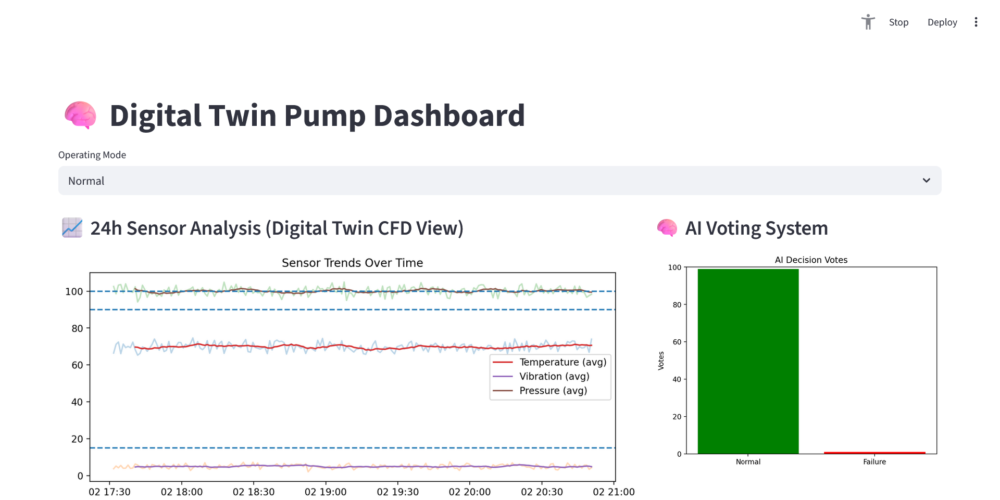
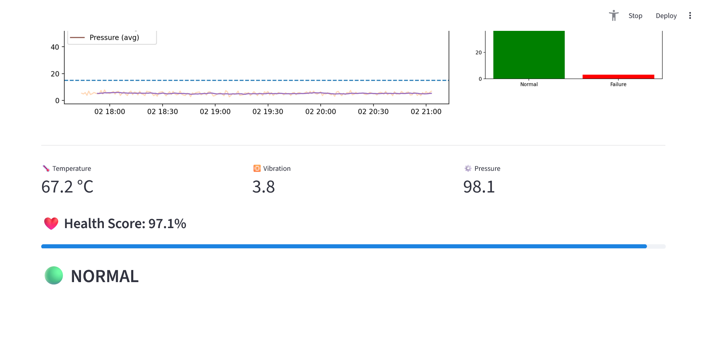
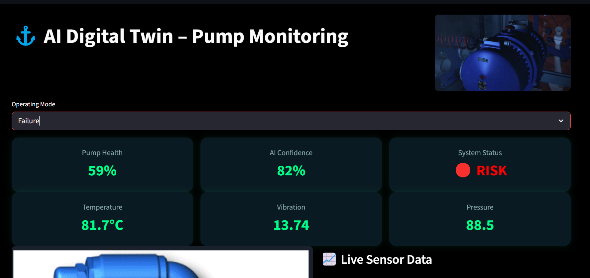
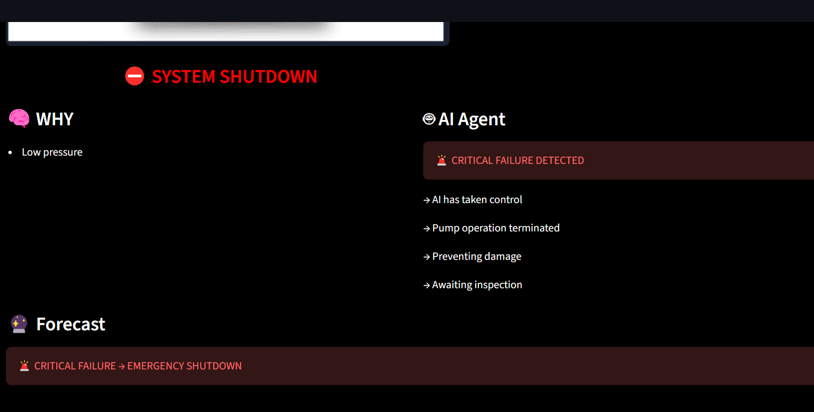

# 🚀 Digital Twin Pump Monitoring System

Real-time AI-powered predictive maintenance dashboard  
⚓ Inspired by industrial oil & gas and marine systems  

---

## 📌 Overview

This project demonstrates a **Digital Twin of an industrial pump**, combining real-time simulation with machine learning to predict equipment failure.

The system simulates sensor data (temperature, vibration, pressure) and uses an AI model to analyze system health and detect anomalies before failure occurs.

---

## 🎯 Key Features

### 🔁 Real-Time Digital Twin Simulation
- Continuous generation of sensor data  
- Mimics real industrial telemetry streams  
- Supports multiple operating conditions  

### ⚓ Operating Modes
- **Normal** → Stable operation  
- **Degrading** → Gradual performance decline  
- **Failure** → Critical system behavior  

### 🧠 Machine Learning (Random Forest)
- Predicts failure using:
  - Temperature  
  - Vibration  
  - Pressure  
- Ensemble model improves robustness and accuracy  

### 📊 AI Decision Visualization
- Displays how individual trees vote  
- Provides transparency into model decisions  

### ❤️ Health Score (0–100%)
- Aggregated system condition indicator  
- Converts raw sensor data into actionable insight  

### 🚨 Alert System
- Visual warning and alarm for critical states  
- Inspired by SCADA and industrial monitoring systems  

### 📈 Time-Series Analysis (CFD-Inspired)
- 24h-style sensor trend simulation  
- Smoothed curves for engineering-style analysis  
- Threshold-based failure visualization  

---

## 🏗️ System Architecture
Digital Twin (Simulation)
↓
Sensor Data (Temperature, Vibration, Pressure)
↓
Machine Learning Model (Random Forest)
↓
Health Score + Prediction
↓
Streamlit Dashboard (Visualization)

## ▶️ Run the Dashboard

streamlit run dashboard.py

## 💡 Use Cases

This project demonstrates concepts used in:

- Predictive maintenance  
- Asset performance monitoring  
- Industrial IoT (IIoT)  
- Oil & Gas / Marine systems  
- Condition-based monitoring  

---

## 🧠 What I Learned

- Designing and simulating a Digital Twin system  
- Combining rule-based logic with machine learning  
- Building real-time dashboards with Streamlit  
- Interpreting AI model behavior (ensemble models)  
- Structuring a production-like engineering project  

---

## 🚀 Future Improvements

- Predict remaining useful life (RUL)  
- Integrate real IoT / sensor data  
- Deploy to cloud (Azure / AWS)  
- Add automated maintenance recommendations  
- Use time-series models (LSTM / ARIMA)  

---

## 👨‍💻 Author

Developed as a demonstration of Digital Twin and AI-based predictive maintenance systems.

📬 Demo

🎬 Video demo:
[https://www.youtube.com/watch?v=q3fwkgnFMTY]

💻 GitHub Repository:
[https://github.com/AbdiTeck/Digital-Twin-AI-]