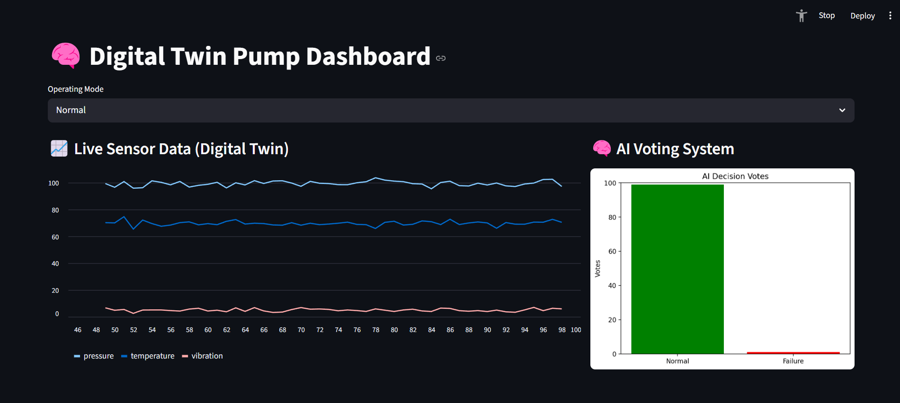
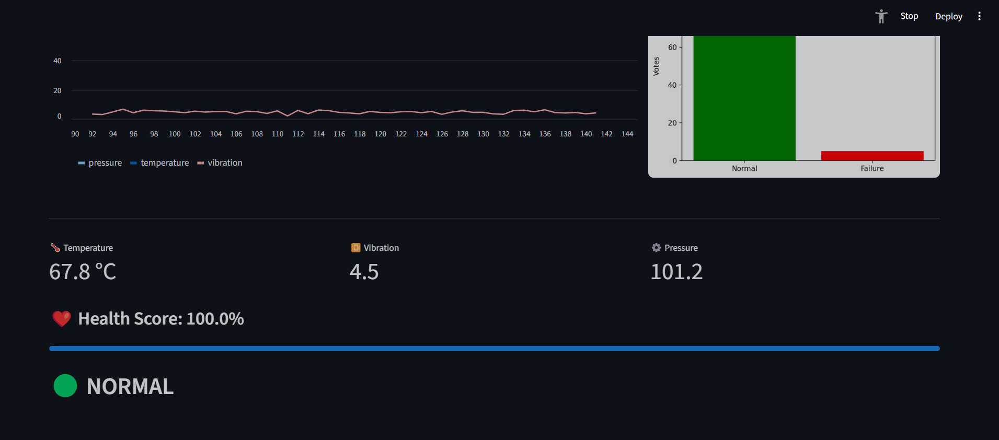
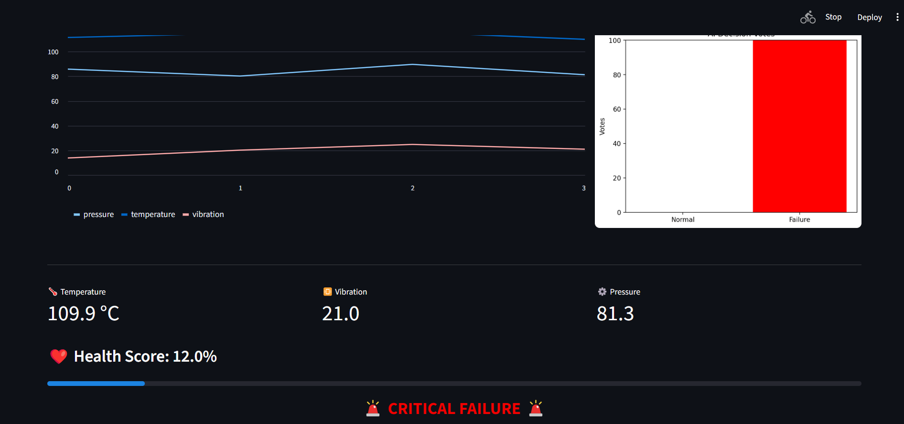

🧠 Digital Twin Pump Monitoring System

🚀 Real-time AI-powered predictive maintenance dashboard
⚓ Inspired by industrial oil & gas and marine systems

📌 Overview

This project is a Digital Twin simulation of an industrial pump, designed to demonstrate how real-time sensor data and machine learning can be used for predictive maintenance.

The system continuously simulates operational data and uses an AI model to detect early signs of failure.

🎯 Key Features

🔁 Real-Time Simulation
Continuous sensor data generation
Mimics real industrial telemetry streams

⚓ Operating Modes
Normal → Stable conditions
Degrading → Gradual performance decline
Failure → Critical system breakdown

🧠 Machine Learning (Random Forest)
Predicts failure using:
Temperature
Vibration
Pressure
Uses ensemble learning for robust predictions

📊 AI Decision Visualization
Displays how individual trees vote
Improves interpretability of the model

❤️ Health Score (0–100%)
Aggregated system condition indicator
Translates raw sensor data into actionable insight

🚨 Alert System
Visual alarm when critical thresholds are reached
Inspired by real SCADA/monitoring systems

🏗️ System Architecture
Digital Twin (Simulation)
        ↓
Sensor Data (Temp, Vib, Pressure)
        ↓
Machine Learning Model (Random Forest)
        ↓
Health Score + Prediction
        ↓
Streamlit Dashboard (Visualization)

🧪 Failure Detection Logic

The system combines rule-based thresholds with machine learning:

Temperature > 100°C
Vibration > 15
Pressure < 90

These conditions represent typical failure indicators in rotating equipment.

⚙️ Tech Stack
Python
Streamlit (UI & dashboard)
Scikit-learn (Machine Learning)
Pandas / NumPy (data handling)
Matplotlib (custom visualizations)

▶️ Getting Started
1. Install dependencies
pip install -r requirements.txt
2. Run the application
streamlit run dashboard.py
📸 Preview

💡 Use Cases

This system demonstrates concepts used in:

Predictive maintenance
Asset performance monitoring
Industrial IoT (IIoT)
Energy / Oil & Gas / Marine systems

🧠 What I Learned
How to design and simulate a Digital Twin system
Combining rule-based logic with machine learning
Building real-time interactive dashboards with Streamlit
Interpreting and debugging ML model behavior
Structuring a project for production-like clarity and usability

🚀 Future Improvements
Predict time-to-failure (remaining useful life)
Integrate real sensor / IoT data streams
Deploy to cloud (Azure / AWS)
Add automated maintenance recommendations
Improve model with time-series forecasting (LSTM / ARIMA)
👨‍💻 Author

Developed as a demonstration of Digital Twin and AI-based predictive maintenance systems.

💻 GitHub Repository:
[https://github.com/AbdiTeck/Digital-Twin-AI-]

=======
# Digital-Twin-AI-
Digital Twin Pump Monitoring System using AI.

